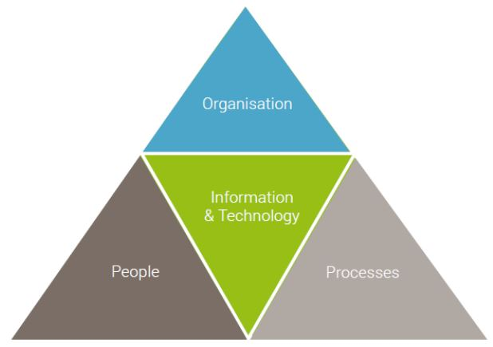
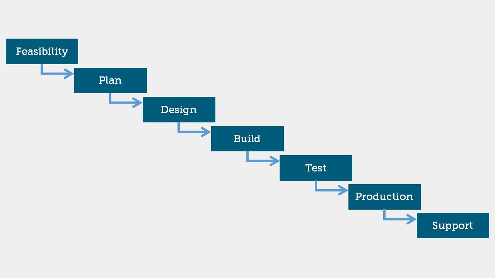
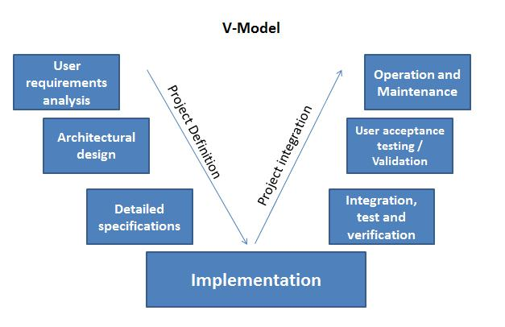
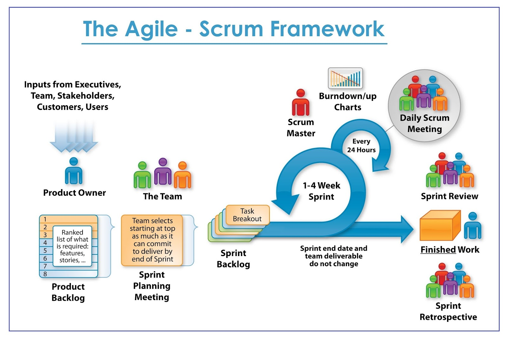
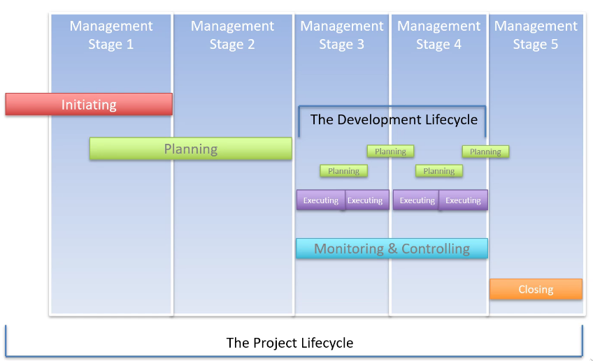
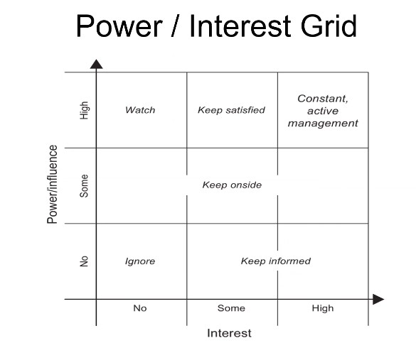

# Project Env

### What is BAU?
- Business-as-Usual aka BAU: Refers to normality of corporate routine and workflow - example (starting work everyday at 9am)

### Project work 
- Project Work: Corporate environment tasks and workflow. Meeting target and delivering products.

#### Project: 
- Inititation 
- Planning
- Executing
- Monitoring and controlling 
- Closing

### The triple constraint:
- Finding balance between each aspect of the constraint (Time, Cost, Quality).

### POPIT Model - Holistic Triangle 
People, The Organistation and Business Process are all reliant on technology as diagram below displays.

### Benefits of well managed project
- Easier to predict cost and time.
- Factors that impede productivity eliminated from onset.
- Less stress for personnel working on the project.
- Deadlines met.

## Software Development LifeCycle - SDLC
### methodologies:
### Waterfall

### V-model

### Agile 
The Agile Methodology is an approach in software development that focuses on iterations while emphasizing the rapid delivery of an application.
- The client can frequently be in contact with the developer to see the work’s progress enabling them to make decisions and changes along the way if needed.
- This will make the product become more user focused.
- Gives the client a sense of ownership.
- It also enables the product to be released with basic functionality.

- Common Practice:
It is not common practice for an organisation to switch methodologies.
If resources are available a company may choose to do so if beneficial.
Industries may have different methodolies. 

### Iterative environment (agile)

### Management Plans and SDLCS

### Scrum Roles 
- BA - Business Analyst
- PM - Project Management
- QA - Quality Assurance
- UX - User Experience (aka Front-End)
- DEV - Developer

#### Return On Investment (ROI)

- Return on investment refers to people wwho have a vested interest in the development and progress of this project. (Directors, Investors, PM etc)
- A lot of people are involved in the approval of a business case
- Expected benefits = ROI
- Execution time = How long / ROI Time
- Exec Summary 
- Investment Appraisal 
- Solutions/Options
- Major Risks
- Stakeholders/Communication Plan
 
#### The worth of the product to the people who need it (will suggest whether its a good ROI)
### Risks:
- Technology
- Team 
- Scope
- Business
- Economy
- Competition

### Dealing with risk
- Avoidance
- Transfer of ownership 
- reduce
- accept
- Exploit to maximise positive impact
- share - involve other parties (management and investment)
- Enhance 
- Ignore (Detrimantal)

### Stakeholders:
#### Whoever is involed in the success of the product or company
#### Power/Interest Grid: 

### Importance of DevOps
[DevOps Defined](https://web.microsoftstream.com/video/1d5b348a-ca1d-4262-85dd-cf1657d34183)

- What the importance is of DevOps engineers in terms of their interest level in a working environment.
- DevOps Engineers do not need to know how to build the whole application but they do need to understand the code and how the pipeline is effective, or not.
- DevOps is a cross dicsiplinary role.

### DevOps Need to know
- MVC - Front End
- Continuous Integration (CI) 
- Continuous Delivery (CDE)  
- Continuous Deployment (CD)  

### The Directors have the least interest in whats going on in projects - But have maximum power.
### Stake holder Attitudes
- Champs - Those who fight for the project. 
- Supporter -  Managers.
- Neutral - Engineers with no particular vested interest.
- Critic - Pessismists of the project.
- Opponent - Against the project.
- Blocker - Completely Against the project and attempt to block it.
