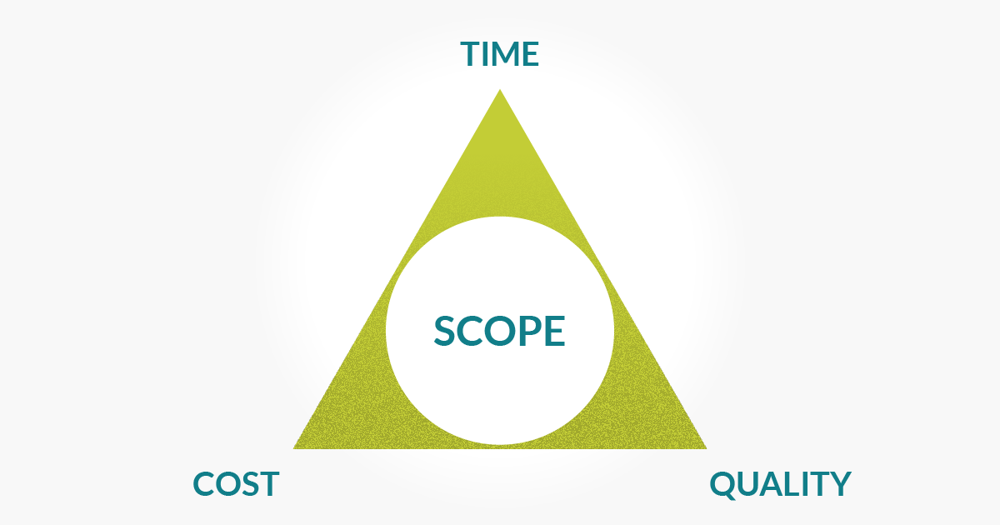

### Project Env

#### - What is BAU?
- Business-as-Usual

##### Difference between BAU and Project work 

- BAU: Refers to normality of corpporate routine and workflow - example (starting work everyday at 9am)

- Project Work: Corporate environment tasks and workflow. Meeting target and delivering products.

##### Project: 
- Inititation 
- Planning
- Executing
- Monitoring and controlling 
- Closing

##### The triple constraint:
- Finding balance between each aspect of the constraint (Time, Cost, Quality).

POPIT Model (Holistic Triangle) 
people, organistation, process are all reliant on technology

Benefits of well managed project
- easier to predict cost, time (therefore reduce things that impede)
- less stress for the ppl working on the project
- Deadlines Met more accurately

SDLC (pic on phone)
methodologies:
- Waterfall 
- V-model
- Agile 

This choice is up to the organisation and tech team 

is it common practice to swtich between methodologies ? 

methodology can differ. between project if the funding and the resources
industries may use different methodolies 

Engineering - V- Model 
Tech - Agile 

Waterfall pic on phone
iterative env (agile)

Increment means to deliver what was worked on and learnt at the next 

Scrum is completely Transparent
improves visibilty of project - constant updates and meetings of progress

Management Plans and SDLCS

pic on phone

HOMEWORK: 

Find out what SCRUM Artefacts and Events Are.

- Working in Project Teams - 

Devops Vid on phone - Know in depth what DEVOPS is.

Why do projects fail 
Lean development

DevOps is ccross functional

We are a mixture of Operations and developers
MVC (front end back end)
CI/CD
AWS - deployment - back end

github 
webhook to jenkins
jenkins run code and try to pass
jenkins will pass to aws
if test pass code is deployed by aws 

BA - 
PM - project manager
QA 
UX
DEV

ROI:

A lot of people are involved in the approval of a business case
Expected benefits = ROI
Execution time = How long / ROI Time
Exec Summary = 
Investment Appraisal 
Solutions/Options
Major Risks
Stakeholders/Communication Plan

You ideas will make you money

The worth of the product to the people who need it (will suggest whther its a good ROI)

Risks:

Technology
Team 
Scope
Business
Economy
Competition

Dealing with risk
avoidance
transfer ownership 
reduce
accept

Exploit to maxixmise positive impact
share - involve other parties (management and investment)
Enhance - 
Ignore - You'll Will fail 

Stakeholders:

Whoever is involed in the success of the product or company

Power/Interest Grid: 
Image in word Doc

What is the importance of DevOps engineers in terms of their interest level in a working env.

DevOps have soft power at being asble to suggest best practices and tools.

How much interest do you think devops engineers are valued in a company

*The Directors have the least interest in whats going on in the class - But have maximum power

Stake holder Attitudes

Champs - they are the riders of the projects (managers?)
supporter -  Managers
Neutral - (low engineers)
Critic - (haters)
Opponent - (against)
Blocker - (Pessismists)

Devops do not need to know how to build the whole product but need to understand how it runs and works

projects are difficult (pic on phone)

why project fails (pic on phone) - Group presentation 
