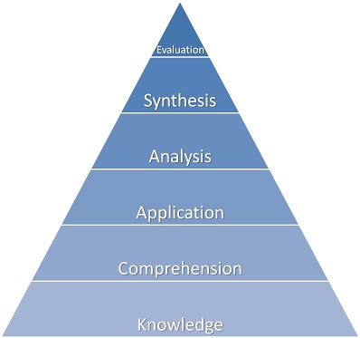

# Day 3

- Stand-Up (Previous day Recap)
- Critical Thinking
- Project Env
- Agile Benefits
- Agile and Scrum Presentation

## Critical Thinking
__What is critical thinking:__

Critical Thinking refers to asking questions, the right questions.
A critical mindset helps you assess the meaning and claims of arguments.

__Why critical thinking:__

Helps you to create a strong argument by justifying claims with facts 
Helpful in every aspect of business as it requires ability to gather factual information.

__Truth:__ 

Critical thinking will foster and promote truth.

### Critical Thinking skills
- Actively seeking out all sides of an argument (people) 
- Checking facts and evidence
- Responding Objectively

### Ben Gloom's Thinking Triangle

- Evaluate - Presenting and defending opinions.
- Synthesise - Combine the information into a new theory to further research and work on.
- Analyse - What the imapact is or would be.
- Apply - Being able to make us of the knowledge and put it to practice.
- Understanding - Knowing what makes sense and what does not. 
- Remember - Having the knowledge, re-calling information. 

### Critical Thinking Process
- Identify:

1. The mains points of argument.
2. Identify the claims made.
3. The evidence used to make claims.
4. Reach conclusion

- Analyse:

1. Be inquisitive and find out facts from research. 
2. Find recent information to support claim.
3. Be careful not to fall into biased views and claim factual opinions 'solid'.

- Apply:

1. Whether viability of fact is fitting.
2. The implication of other information

### Modes of Thinking
- __Divergent:__ Colming up with ideas once the claim has been presented. 
- __Convergent:__ Relying on facts and research to form asnwer.
- __Lateral:__ Hybrid of both Divergent and Convergent.

### Thinking Hats 
- White: Factual analysis
- Blue: Thinking 
- Green: Creativity
- Red: Emotions, Feelings
- Black: Judgement
- Yellow: Optimism, Brightness

#### Conceptual balance between all hats will ensure a succesfull environment.

### Enquiry Based learning
 - Concluding on your research and converstion to come best conclusion possible.
- Open question: How? when? where?
- Closed question: Did you do this? (accusational conversation)
- Investigate

### Enquiry Cycle
 - Investigate
 - Reflect 
 - Enquire
 - Create
 - Conclude

### What Kind of quesutions might we when investigating
- Source
- claims
- Evidence 
- Strengths and Weaknesses
- Clear points 
- Balance of information
- Underlying themes
- Background

#### Definition of an Argument
- Opposition of conflicting beliefs and ideas or facts.

### How to present your idea

#### Debating Etiquette
- Listen before talking 
- Reflect on the strength of other argument
- Be contructive 
- If someone opposes your facts, ask for their counter facts
- Are they biased?

The Art of Persuasion -- (find Books) 
- Constructing arguments
- Listening !!! - Makes the other person feel listend to, opinion valued
- Appealing to their Ego

####Pillars of Rhetoric

__Ethos:__ 
- Appealing through authority. 

__Pathos:__ 
- Emotional empathy.

__Logos:__
- Appealing trhough logic and reasoning.

